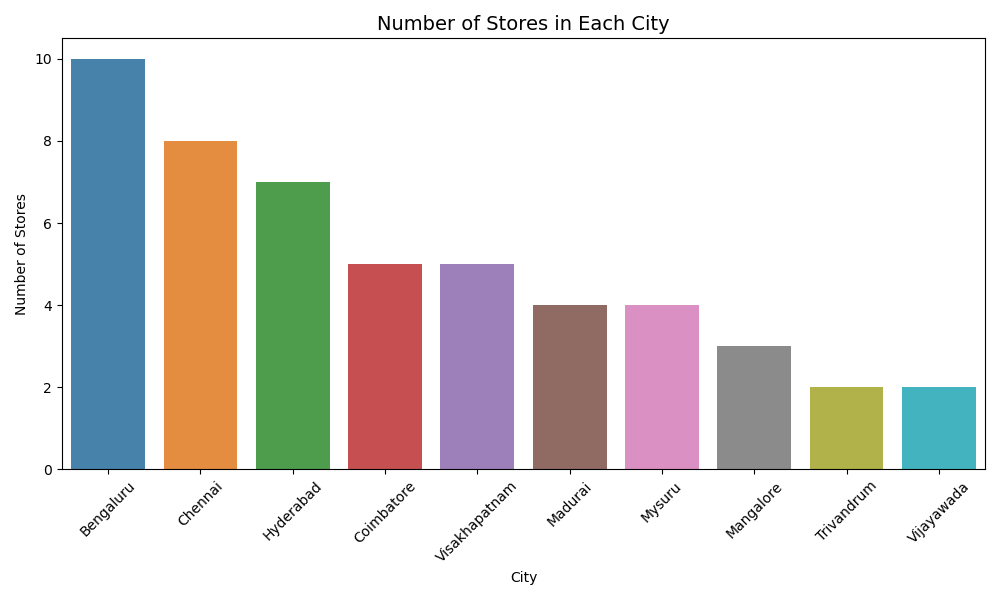
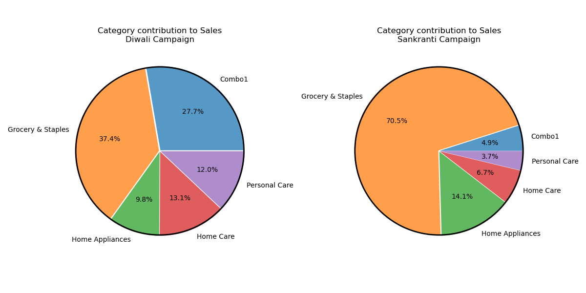
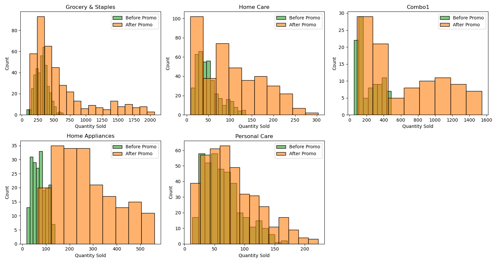
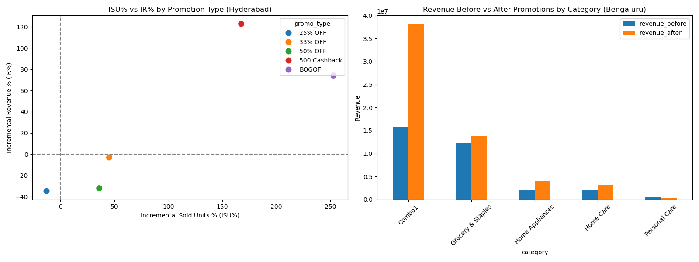
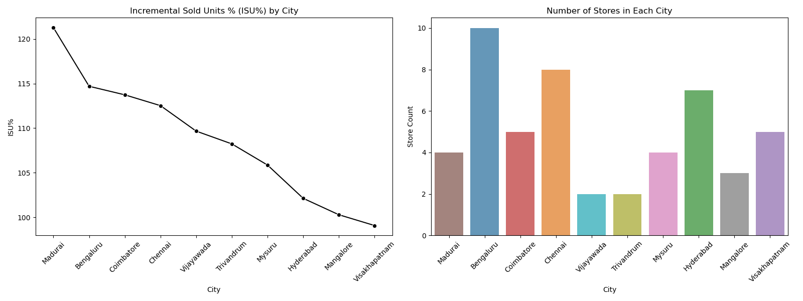

# AtliQ Mart Promotions Data Analysis

This project is part of the **Codebasics Virtual Internship** where I analyzed the impact of various promotions on sales performance across different cities, stores, and product categories for **AtliQ Mart**.  

The analysis was done using **Python (Pandas, Matplotlib, Seaborn)** and insights were derived through visualizations and metrics like Incremental Sales Units (ISU%) and Incremental Revenue (IR%).  

---

## 📸 Visualizations

  
  
  
  
  
  

---

## 🧑‍💻 Tools & Libraries

- Python (Pandas, NumPy)  
- Matplotlib, Seaborn (Visualization)  
- Jupyter Notebook  

---

